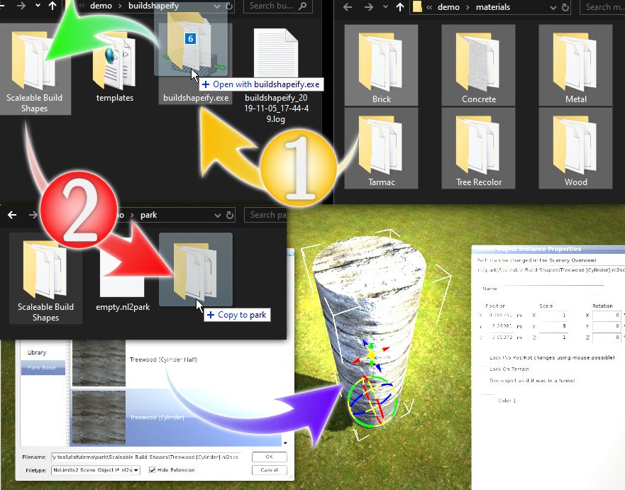
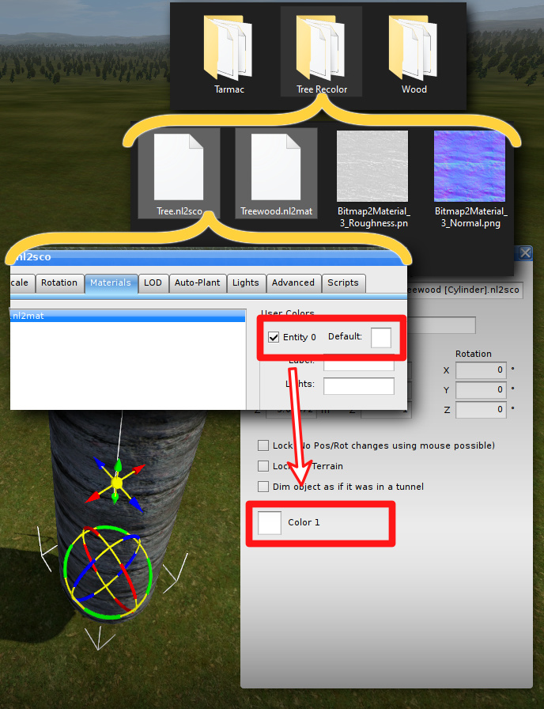

# Buildshapeify for NL2 

is a tool that reads nl2mat files for the [NoLimits 2 - Roller Coaster Simulation](http://www.nolimitscoaster.com/) and creates a scalable versions out of it for the [Scaleable Build Shapes](https://www.youtube.com/watch?v=ac9bl-vS1Xg) package.

## Usage
is done simply by dragging and dropping the desired folders or files onto an executable: 

1. Drag Directories with nl2mats and example nl2sco onto the tool.
2. Copy the created output into the park directory with an existing [Scaleable Build Shapes](https://www.youtube.com/watch?v=ac9bl-vS1Xg) package.

### Grouping Materials into Folders
is useful when you also want to setup a nl2sco file that depends on the material settings in the same folder, like when it must use custom colors for the material shading. 

## Installation
is done by either choosing the a standalone executable (Windows only) package that can be launched from everywhere or use the hackable Python script together with a manual installation of [Python 3](https://www.python.org/) on every system.

## Advanced Users
can create custom templates by creating custom xml files in the same fashion as the preset ones. You might refer to the NL2 manual or compare the output of the nl2mat and nl2sco editor for reference of the available NL2 specific options. 

## Dependencies for Developers
is [Pyinstaller](https://www.pyinstaller.org/) if you want to create the standalone executable.
